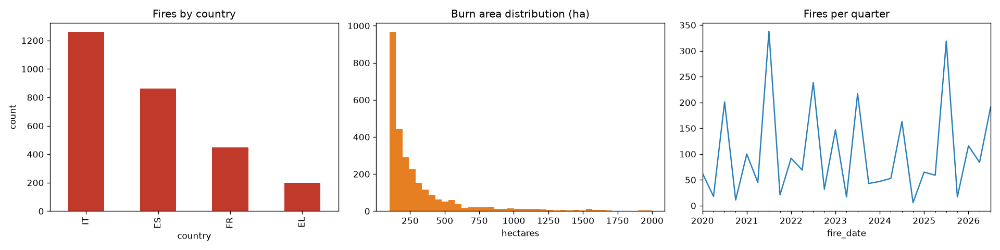

# burn2scar

A Sentinel-2 burn-scar segmentation dataset built from real, unsimulated satellite
imagery paired with EFFIS-derived labels — the pipeline behind
[huggingface.co/datasets/neet1797/burn2scar](https://huggingface.co/datasets/neet1797/burn2scar).

---

## What this is

For each wildfire in the EFFIS (European Forest Fire Information System) record,
this pipeline finds the best available Sentinel-2 scene and produces:

- A **13-band Sentinel-2 L1C image** (top-of-atmosphere reflectance, native 10 m resolution)
- A **7-class segmentation mask** at the same resolution and extent

No sensor simulation is applied. Bands are Sentinel-2's own native radiometry,
resampled to a common 10 m grid (unavoidable, since S2's 13 bands natively span
10 m / 20 m / 60 m) and cropped to a fixed tile around each fire. No atmospheric
correction, denoising, or synthetic degradation of any kind is applied.

---

## Classes

| Mask value | Class | Definition |
|---|---|---|
| 0 | clear | No burn, cloud, shadow, or water detected |
| 2 | fresh burn | Burned area, ≤ 90 days since ignition |
| 3 | old burn | Burned area, > 90 days since ignition (up to 365 days) |
| 4 | cloud | Detected via [OmniCloudMask](https://github.com/DPIRD-DMA/OmniCloudMask) |
| 5 | cloud shadow | Detected via OmniCloudMask |
| 6 | water | NDWI > 0.05, or Sentinel-2 Scene Classification (SCL) value 6 |
| 255 | nodata | Outside the valid data mask (tile edge / sensor gap) |

Fresh and old burn come from the same EFFIS fire-perimeter polygons, distinguished
purely by the number of days between the fire's recorded ignition date and the
satellite acquisition date.

---

## Label purity notes

`clear` is a residual class — anything not detected as burn, cloud, shadow, or
water — not a confirmed "vegetation" or "undisturbed land" label. Depending on
your use case this matters: Mediterranean terrain in particular can put bare
soil, exposed rock, and volcanic terrain (present in both Italy and Greece,
two of this dataset's source countries) into `clear`, since the pipeline has no
separate class for them. If your application needs a purer vegetation mask,
combine this dataset with a land-cover product (e.g. ESA WorldCover) and filter
`clear` further based on your own criteria.

Burn labels themselves are only as complete as EFFIS's own detection. EFFIS's
documented minimum mapping unit for burnt-area products is **10 hectares** —
fires smaller than that are not labeled by EFFIS at all, and so appear as
`clear` in this dataset rather than `fresh_burn`/`old_burn`, even where a real
(sub-threshold) fire occurred.

---

## Two scenes per fire

Each fire gets **two independently-acquired Sentinel-2 scenes**, searched in
separate time windows:

- **Fresh window**: 5–60 days after the fire's ignition date
- **Old window**: 120–300 days after ignition

Both windows are searched independently for the least-cloudy available scene where
the fire's own burn scar is not significantly obscured by cloud or shadow (≤ 50% of
the scar's pixels). This means most tile pairs will show a fresh_burn-dominant mask
(early acquisition) and a separate old_burn-dominant mask (later acquisition) for
the same underlying fire — not necessarily both classes within a single image.

**Known limitation:** because both acquisition windows are strictly *post-fire*,
old_burn labels reflect either (a) the fire the tile is centered on, once enough
time has passed, or (b) incidental overlap with a different, genuinely older fire's
perimeter. There is no pre-fire baseline image in this dataset — every scene is
captured after the relevant fire(s) already occurred.

---

## Fire selection

Fires are drawn from an EFFIS export, filtered by:

| Filter | Value |
|---|---|
| Countries | Italy (IT), France (FR — restricted to south of 46°N latitude), Spain (ES), Greece (EL) |
| Date range | 2020-01-01 to 2026-08-04 |
| Minimum area | 5 hectares (excludes marginal / low-confidence micro-detections) |
| Maximum area | 2,000 hectares (excludes mega-fires large enough to make a single tile 100% burn scar, with no useful boundary signal) |

**19,443 fires** queued after filtering; **13,903 fires** yielded at least one
usable, sufficiently cloud-free acquisition (the remainder had no candidate scene
passing the cloud/obscuration threshold in either window) — producing
**26,854 scene/mask pairs** and **30.57 GB** total.

---

## Fire population overview



Characteristics of the underlying EFFIS-sourced fire population, after filtering
(before acquisition — this is about the *input* fire records, not the output
imagery). Left to right: fire count by source country, distribution of burn
area sizes within the 5–2,000 ha bounds, and seasonal distribution of fires
by quarter across the 2020–2026 date range — wildfire activity concentrates
heavily in the Mediterranean summer months, as expected.

---

## Class distribution

Computed across all 26,854 masks (1.76 billion pixels total):

| Class | % of valid pixels |
|---|---|
| clear | 82.62% |
| old_burn | 7.21% |
| fresh_burn | 7.12% |
| water | 2.32% |
| cloud | 0.54% |
| shadow | 0.19% |

0.95% of all pixels are nodata (tile-edge artifacts from UTM reprojection),
excluded from the percentages above. Fresh and old burn are closely balanced —
a direct result of acquiring two independent time windows per fire (see
"Two scenes per fire" above) rather than relying on incidental overlap with
other fires' perimeters.

---

## Tiles

Each scene is a fixed **2.56 km × 2.56 km** tile (256 × 256 pixels at 10 m),
centered on the fire's centroid, reprojected into the local UTM zone.

---

## Bands

`B01, B02, B03, B04, B05, B06, B07, B08, B8A, B09, B10, B11, B12`

Stored as `uint16`, scale factor 10,000 (divide by 10,000 for TOA reflectance,
matching Sentinel-2's own L1C convention).

---

## Source data

- **Imagery**: Copernicus Sentinel-2, via the Copernicus Data Space Ecosystem
- **Burn labels**: EFFIS (European Forest Fire Information System), Copernicus
 Emergency Management Service
- **Cloud / shadow**: [OmniCloudMask](https://github.com/DPIRD-DMA/OmniCloudMask)
- **Water**: NDWI (green/NIR) + Sentinel-2 Scene Classification Layer (SCL)

---

## Pipeline

```
src/effis_loader.py   — loads and filters EFFIS fire perimeters
src/s2_pipeline.py     — acquisition, masking, GeoTIFF export
src/hf_upload.py       — streaming upload to Hugging Face (download → upload → delete, per fire)
run_extraction.py      — driver: multi-threaded, quota-capped, fully resume-safe
```

Each fire is downloaded, processed, and uploaded to Hugging Face individually, then
deleted locally — so total local disk usage stays roughly flat regardless of final
dataset size.

---

## Setup

```bash
git clone git@github.com:paramkaur10/burn2scar.git
cd burn2scar
pip install -r requirements.txt
cp .env.example .env   # fill in your own CDSE + Hugging Face credentials
```

## Run

```bash
python run_extraction.py --config config.yaml
```

Resumable — safe to stop and restart at any time. Already-uploaded fires are
tracked in `output/quota_state.json` and skipped on the next run.

---

## Data

This repository contains no data and no credentials — only the code that produced
the dataset. The dataset itself lives at
[huggingface.co/datasets/neet1797/burn2scar](https://huggingface.co/datasets/neet1797/burn2scar).

## Attribution

Contains modified Copernicus Sentinel data. Burn labels derived from EFFIS
(European Forest Fire Information System), Copernicus Emergency Management Service.

---

**Author:** Parampuneet Kaur Thind (Param)